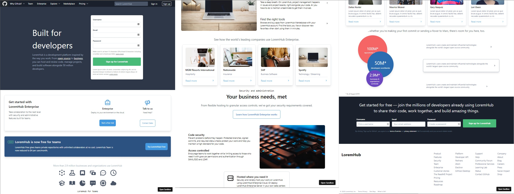

# React mock websites

_Built exclusively with React & Tailwindcss_

Practice and mimic famous websites by using React and other stacks on frontend. Built from the scratch entirely.

Please check details on each subfolder of the project.

### Github Mock - [LoremHub](github-mock):

- Target website: [Github (Sept, 2020)](https://github.com/)
- Mock preview: [LoremHub](https://6v68q.csb.app/)

You can view more preview codes on
[Code Sandbox](https://codesandbox.io/s/github-mock-6v68q).

---

### New York Times Mock - [Old York Times](./nytimes-mock):

- Target website: [The New York Times (Oct, 2020)](https://www.nytimes.com/)
- Mock preview: [The Old York Times](https://ejh0y.csb.app/)

You can view more preview codes on
[Code Sandbox](https://codesandbox.io/s/nytimes-mock-ejh0y).

---

### Youtube Mock - [LoremTube](./youtube-mock):

_Enable to switch between light / dark theme_

- Target website: [Youtube (Oct, 2020)](https://www.youtube.com/)
- Mock preview: [LoremTube](https://3l21h.csb.app/)

You can view more preview codes on
[Code Sandbox](https://codesandbox.io/s/youtube-mock-3l21h).

---

# Other reference

- Image Source - [Unsplash](https://unsplash.com/)
- Icon Source - [heroicon](https://heroicon.com/)

# License

MIT
