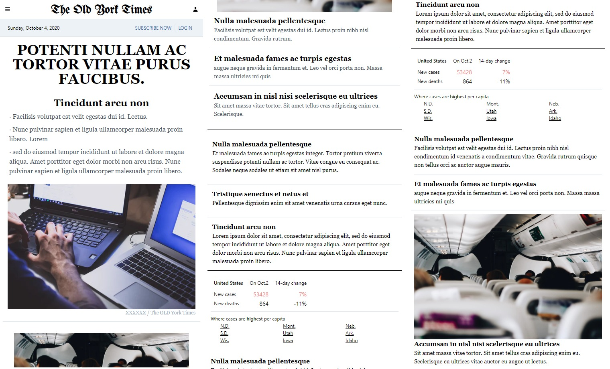

# React mock websites

Practice and mimic famous websites by using React and other stacks on frontend. Built from the scratch entirely.

Please check details on each subfolder of the project.

### Github Mock - LoremHub:

_Built exclusively with React & Tailwindcss_

- Target website: [Github (Sept, 2020)](https://github.com/)
- Mock preview: [LoremHub](https://6v68q.csb.app/)

More preview code can be check on
[Code Sandbox](https://codesandbox.io/s/github-mock-6v68q).

---

### New York Times Mock - Old York Times:

_Built exclusively with React & Tailwindcss_

- Target website: [The New York Times (Oct, 2020)](https://www.nytimes.com/)
- Mock preview: [The Old York Times](https://ejh0y.csb.app/)

More preview code can be check on
[Code Sandbox](https://codesandbox.io/s/nytimes-mock-ejh0y).

# Sample Image

[Unsplash](https://unsplash.com/)

# License

MIT
