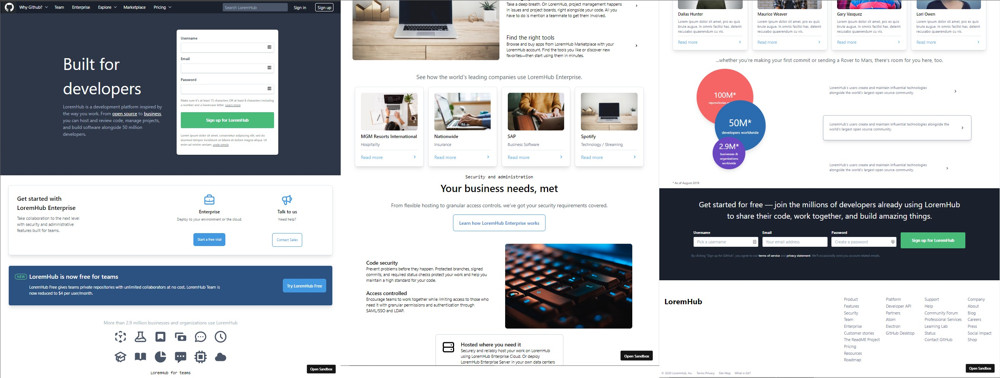
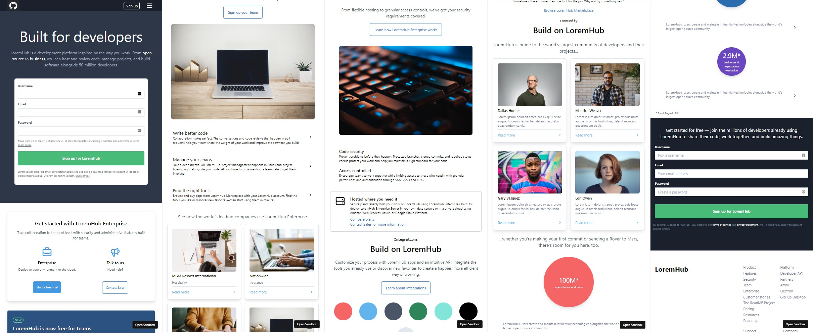
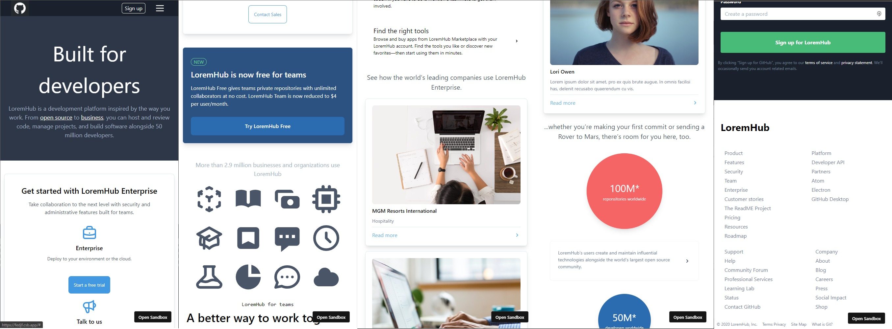
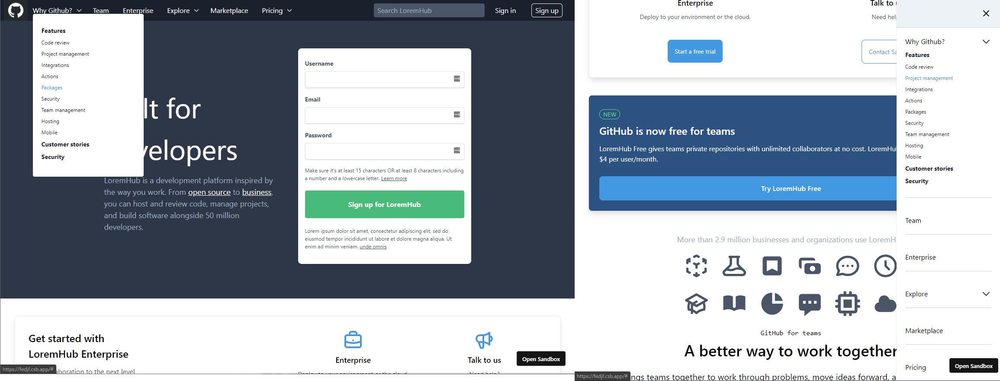

# Github Mock - LoremHub

_Built exclusively with `React` & `Tailwindcss`_

- Target website: [Github (Sept, 2020)](https://github.com/)
- Mock preview: [LoremHub](https://6v68q.csb.app/)

You can view more preview codes on
[Code Sandbox](https://codesandbox.io/s/github-mock-6v68q).

## Finished particial features

- Simulate the current github responsive design (sm, md & lg view)
- Nav menu dropdown and panel

_Desktop_




_Mobile_


_Nav dropdown & panel_


Stacks:

- [react](https://reactjs.org/)
- [tailwindcss](https://tailwindcss.com/)

Deploy

```
yarn install

yarn start
```
