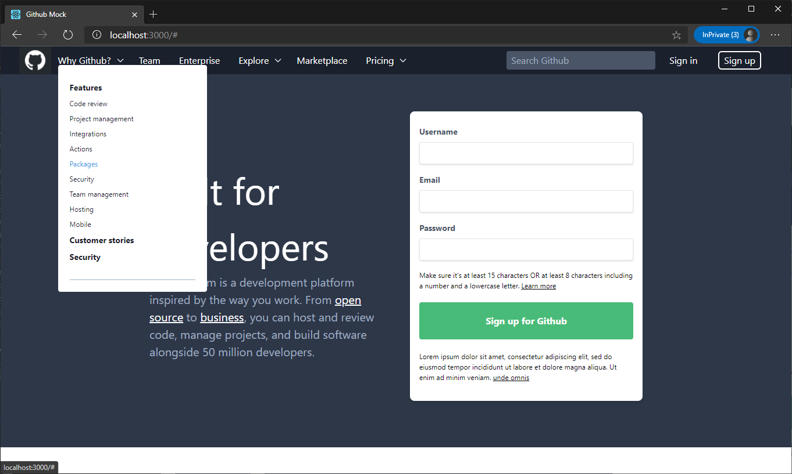
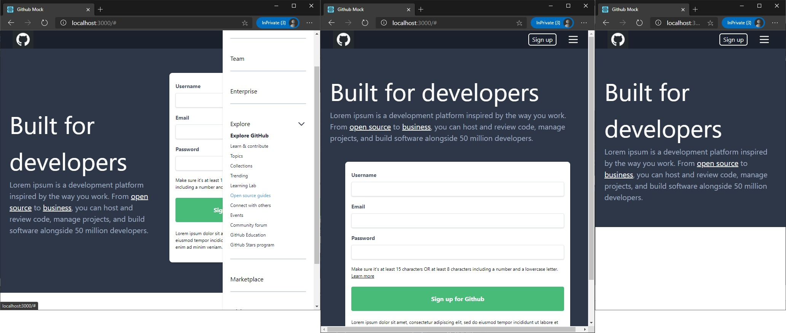

# Github Mock

[CodeSandbox](https://codesandbox.io/s/github-mock-6v68q)

_in process_

Using `react` & `tailwindcss` mock Github.




Stacks:

- [react](https://reactjs.org/)
- [tailwindcss](https://tailwindcss.com/)

Deploy

```
yarn install

yarn start
```
