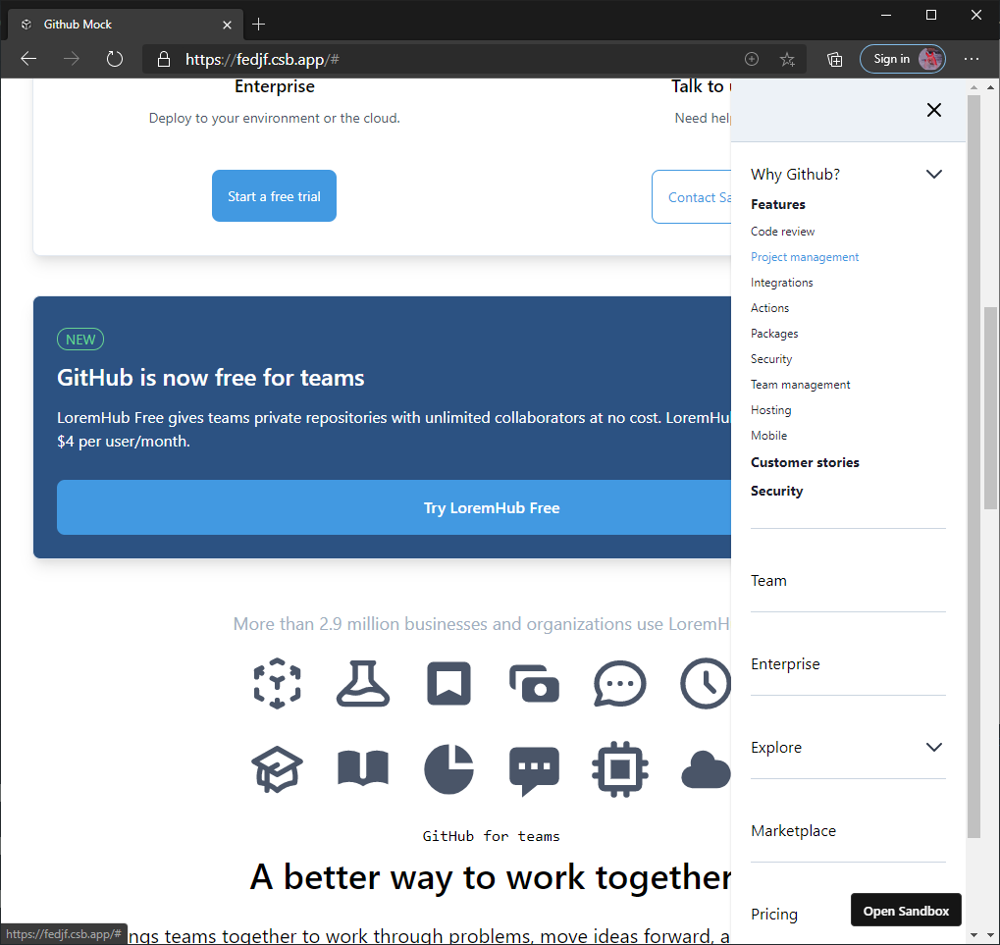
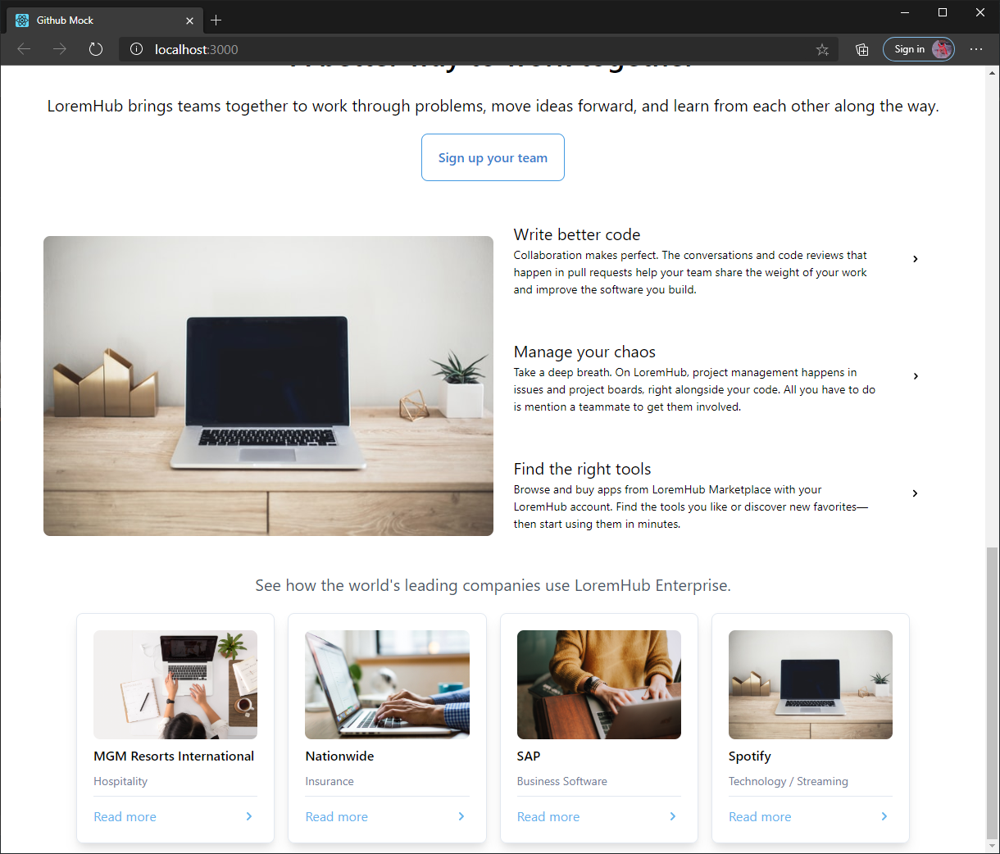
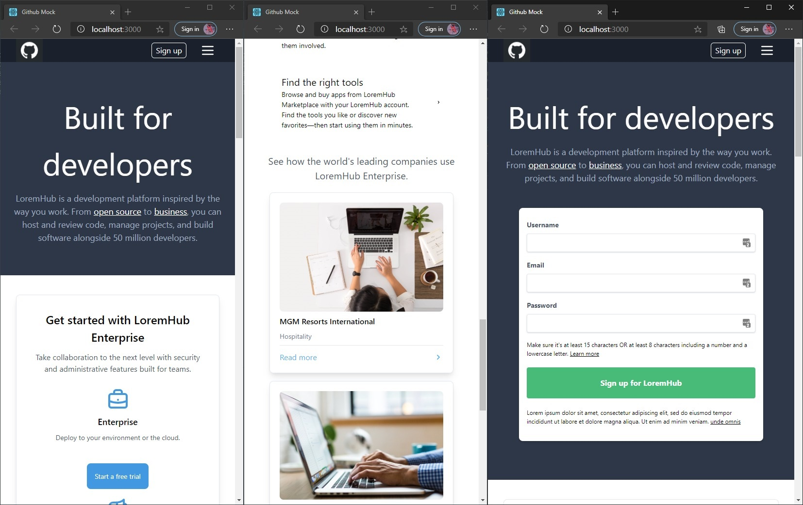

# Github Mock - LoremHub

Please check [Code Sandbox](https://codesandbox.io/s/github-mock-fedjf)

_in process_

Using only `react` & pure `tailwindcss` mock [Github](www.github.com).

## Finished components

- Simulated current github responsive design (sm, md & lg view)
- Nav menu dropdown and panel







Stacks:

- [react](https://reactjs.org/)
- [tailwindcss](https://tailwindcss.com/)

Deploy

```
yarn install

yarn start
```
