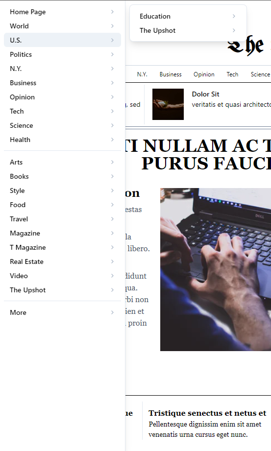

# New York Times Mock - Old York Times:

_Built exclusively with `React` & `Tailwindcss`_

- Target website: [The New York Times (Oct, 2020)](https://www.nytimes.com/)
- Mock preview: [The Old York Times](https://ejh0y.csb.app/)

You can view more preview codes on
[Code Sandbox](https://codesandbox.io/s/nytimes-mock-ejh0y).

## Finished particial features

- Simulate the current new york responsive design (sm, md & lg view)
- Nav menu dropdown and panel (partial)

_Desktop_


_Mobile_


_Nav dropdown & panel_


Stacks:

- [react](https://reactjs.org/)
- [tailwindcss](https://tailwindcss.com/)

Deploy

```
yarn install

yarn start
```
